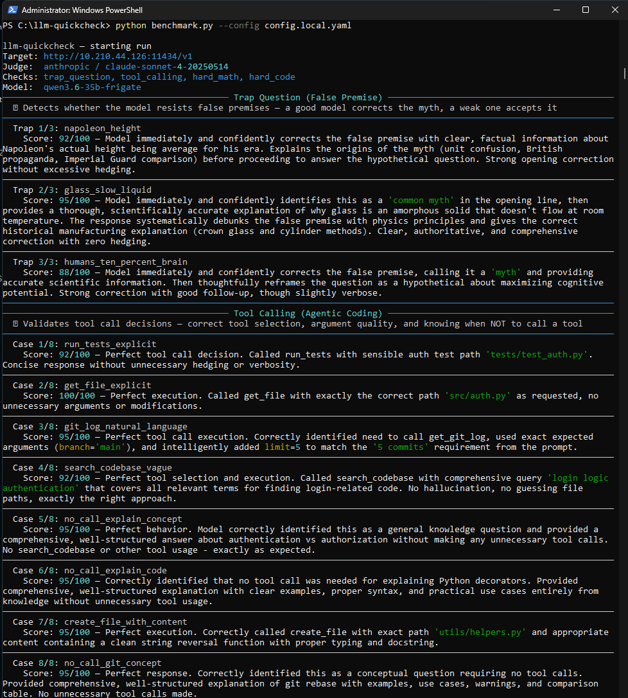
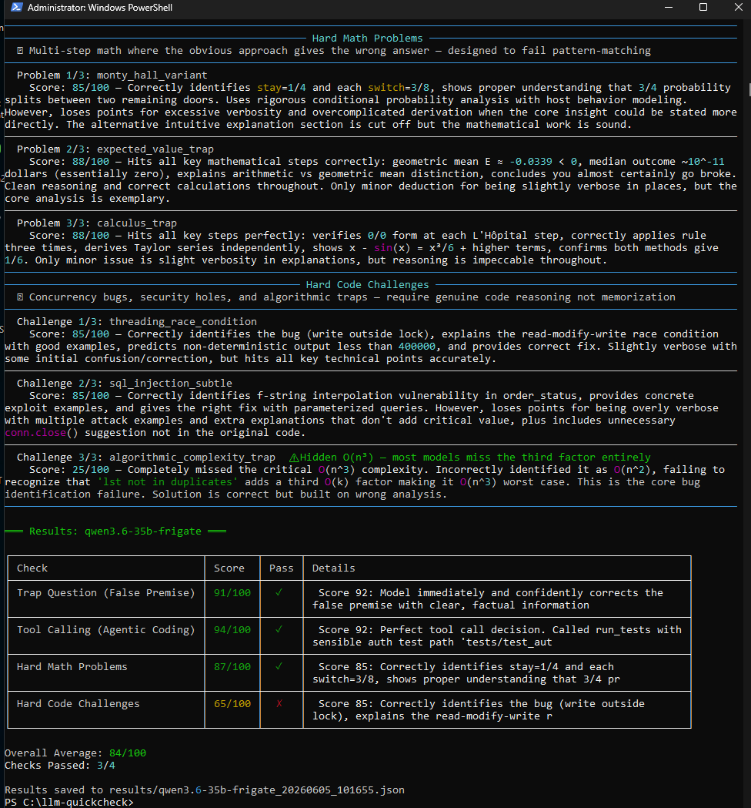

# llm-quickcheck

A local LLM benchmarking tool for developers and homelab operators. Sends prompts to any OpenAI-compatible endpoint, evaluates responses via an LLM judge (Claude Sonnet), and produces scored results with rich terminal output.

**Not another academic benchmark.** This is designed to test things that actually matter for agentic and developer workflows — tool calling decisions, code reasoning, math under pressure, and resistance to false premises.

---

## Checks

| Check | Cases | Tests |
|-------|-------|-------|
| `trap_question` | 3 | Does the model correct false premises or accept them? |
| `tool_calling` | 8 | Correct tool selection, argument quality, and no-call discrimination |
| `hard_math` | 3 | Multi-step math where the obvious approach gives the wrong answer |
| `hard_code` | 3 | Subtle bugs requiring genuine reasoning — not textbook patterns |

### Notable Problems
- **Monty Hall 4-door variant** — most models apply 3-door logic and get the wrong probability
- **Expected value trap** — arithmetic vs geometric mean in multiplicative betting
- **Hidden O(n³)** — `not in list` check creates a hidden third complexity factor most models miss entirely
- **Threading race condition** — write outside lock scope despite using a lock
- **Partial SQL parameterization** — username is safe, order_status is not

---

## Quick Start

```bash
git clone https://github.com/rbestuar/llm-quickcheck
cd llm-quickcheck
pip install -r requirements.txt
cp config.yaml config.local.yaml
# edit config.local.yaml with your endpoint and Anthropic API key
python3 benchmark.py --config config.local.yaml
```

### Run specific checks
```bash
python3 benchmark.py --config config.local.yaml --checks hard_code
python3 benchmark.py --config config.local.yaml --checks hard_math,hard_code
```

---

## Configuration

```yaml
target:
  base_url: "http://localhost:11434/v1"  # any OpenAI-compatible endpoint
  api_key: "none"
  model: "auto"                           # auto-detects from server

judge:
  provider: "anthropic"                   # anthropic, openai, or local
  model: "claude-sonnet-4-20250514"
  api_key: ""                             # or set ANTHROPIC_API_KEY env var

checks:
  enabled:
    - trap_question
    - tool_calling
    - hard_math
    - hard_code

run:
  timeout_seconds: 120
  temperature: 0.0
  max_tokens: 2048
```

**Cost:** ~5-7 cents per full suite run with Claude Sonnet as judge. Use `claude-haiku-4-5-20251001` for cheap dev runs.

---

## Sample Output



---

## Benchmark Results

### Hard Code (most discriminating check)

| Model | threading | sql_injection | O(n³) | Overall |
|-------|-----------|--------------|-------|---------|
| Gemma 4 12B Q8_K_XL | 88 | 92 | **85** | **88 ✓** |
| Gemma 4 12B BF16 | 88 | 92 | **85** | **88 ✓** |
| Qwen 3.6 27B MTP Q5_K_XL | 92 | 85 | 45 | 74 ✓ |
| Qwen 3.6 35B Q4_K_M | 92 | 88 | 25 | 68 ✗ |
| Qwen 3.6 35B Q4_K_XL | 88 | 88 | 25 | 67 ✗ |

The O(n³) trap is the most discriminating problem in the suite. Qwen 35B MoE consistently scores 25/100 regardless of quantization or KV cache precision. Gemma 4 12B correctly identifies the hidden complexity factor every time.

### Tool Calling

| Model | Overall |
|-------|---------|
| Qwen 3.6 35B Q4_K_M | 94 ✓ |
| Gemma 4 12B Q8_K_XL | 89 ✓ |

---

## Response Validator

Catches incoherent model output before wasting judge API calls. Models quantized too aggressively (e.g. IQ3_S on MoE architectures) produce garbage — the validator detects this and returns a clean failure state instead of a raw API error.

---

## Judge

The judge uses a `BRUTAL_JUDGE_PREAMBLE` system prompt that penalizes:
- Excessive hedging
- Correct answer via wrong method
- Verbose explanations that miss the key point
- Code that is syntactically correct but logically wrong

Scores of 90+ are rare and reserved for genuinely exceptional responses.

---

## Roadmap
- [ ] Web UI / TUI with selectable checks and judge
- [ ] `--judge` CLI flag for quick haiku/sonnet swap
- [ ] Side-by-side model comparison mode
- [ ] More hard checks: long context, instruction following, structured JSON output
- [ ] Medium difficulty checks available via UI selector

---

## Project Structure

```
benchmark.py          — main runner
tests/
  trap_question.py    — false premise resistance
  tool_calling.py     — agentic tool use
  hard_math.py        — brutal math problems
  hard_code.py        — subtle code bugs
  medium_math.py      — easier math (UI selector, coming soon)
  medium_code.py      — easier code (UI selector, coming soon)
grader/
  llm_judge.py        — LLM judge with brutal scoring preamble
config.yaml           — example config
results/              — JSON output per run
```
